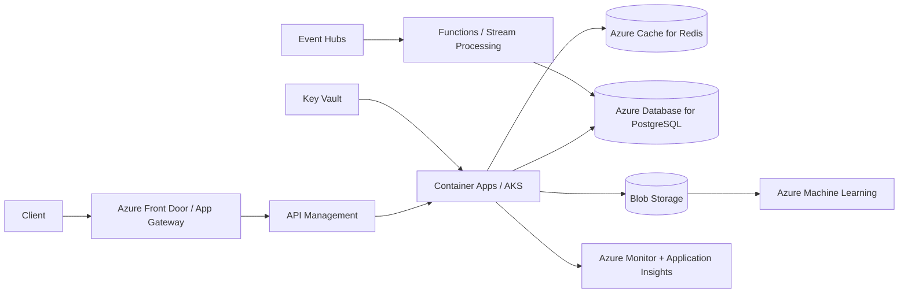

# Azure ML Platform

A reference architecture for deploying the same ML workload on Microsoft Azure.

## Core services demonstrated

- VNet networking, subnets, NSGs and private endpoints
- Container Apps / AKS for model serving
- Blob Storage for model/data artifacts
- Event Hubs and Service Bus for asynchronous/event-driven workloads
- Azure Database for PostgreSQL and Cosmos DB tradeoffs
- Azure Cache for Redis
- Azure Machine Learning for training, registry and endpoints
- Key Vault, managed identities, Azure Monitor and Application Insights

The same workload is mirrored across clouds to make vendor mapping and architectural tradeoffs explicit.
