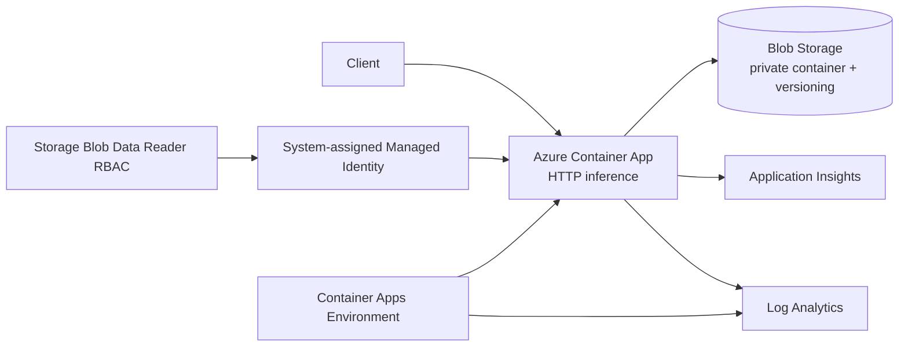

# Azure ML Platform

A Bicep-compiled Azure reference for a containerized ML inference boundary with managed identity, protected artifact storage and first-class telemetry.

> Portfolio reference implementation only. The repository demonstrates a focused serving/platform slice rather than claiming to provision every Azure ML service named in the broader cross-cloud architecture.

## Implemented architecture



## What is implemented

`infra/main.bicep` currently defines:

- a StorageV2 account with public blob access disabled;
- shared-key authentication disabled in favor of OAuth-oriented access;
- HTTPS-only transport and TLS 1.2 minimum;
- Blob versioning plus blob/container soft-delete retention;
- a private `models` blob container;
- a Log Analytics workspace;
- workspace-based Application Insights;
- a Container Apps managed environment wired to Log Analytics;
- an externally reachable Container App with bounded 0–10 replica HTTP autoscaling;
- a system-assigned managed identity on the inference app;
- `Storage Blob Data Reader` RBAC scoped to the storage account;
- Application Insights connection configuration injected into the application;
- Container App console/system diagnostic logs routed to the workspace.

No storage account key is injected into the application. The intended runtime pattern is Azure SDK credential resolution through managed identity.

## Credential-free Bicep CI

Every push and pull request installs the Bicep CLI and compiles the infrastructure to an ARM template:

```text
az bicep install
az bicep build --file infra/main.bicep --stdout
```

This catches Bicep syntax/type errors without placing Azure credentials in pull-request CI. Compilation validates the template shape; it is not a substitute for a live deployment/what-if against an Azure subscription.

## Cross-cloud mapping

| Platform concern | Azure implementation here | AWS analogue | GCP analogue |
|---|---|---|---|
| Container serving | Container Apps | ECS/Fargate | Cloud Run |
| Artifact storage | Blob Storage | S3 | Cloud Storage |
| Runtime identity | Managed Identity + RBAC | IAM task role | Service account + IAM |
| Logs | Log Analytics | CloudWatch Logs | Cloud Logging |
| APM | Application Insights | CloudWatch/X-Ray/OpenTelemetry | Cloud Monitoring/Trace |
| Autoscaling | Container Apps HTTP rule | ECS Application Auto Scaling | Cloud Run scaling |

## Broader Azure service map

For interview/vendor translation, the wider portfolio maps AKS, Functions, Event Hubs, Service Bus, Azure Database for PostgreSQL, Cosmos DB, Azure Cache for Redis, Key Vault, API Management, Front Door and Azure Machine Learning to equivalent workload concerns. Those are architectural alternatives unless they are represented by code in this repository; the list above is the concrete compiled Bicep stack.

The repository contains no employer data, credentials or proprietary infrastructure.
