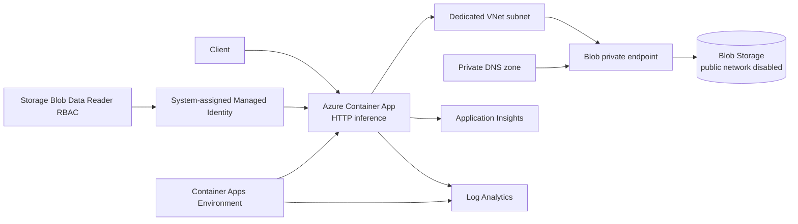

# Azure ML Platform

A Bicep-compiled Azure reference for a containerized ML inference boundary with managed identity, protected artifact storage and first-class telemetry.

> Portfolio reference implementation only. The repository demonstrates a focused serving/platform slice rather than claiming to provision every Azure ML service named in the broader cross-cloud architecture.

## Implemented architecture


```mermaid
flowchart LR
    U[Client] --> APP[Azure Container App\nHTTP inference]
    APP --> VNET[Dedicated VNet subnet]
    VNET --> PE[Blob private endpoint]
    PE --> BLOB[(Blob Storage\npublic network disabled)]
    DNS[Private DNS zone] --> PE
    APP --> AI[Application Insights]
    APP --> LAW[Log Analytics]
    MI[System-assigned Managed Identity] --> APP
    RBAC[Storage Blob Data Reader RBAC] --> MI
    ENV[Container Apps Environment] --> APP
    ENV --> LAW
```

## What is implemented

`infra/main.bicep` currently defines:

- a StorageV2 account with public blob access disabled;
- storage public-network access disabled with a default-deny firewall and no trusted-service bypass;
- shared-key authentication disabled in favor of OAuth-oriented access;
- HTTPS-only transport and TLS 1.2 minimum;
- Blob versioning plus blob/container soft-delete retention;
- a private `models` blob container;
- a dedicated virtual network with separate Container Apps and private-endpoint subnets;
- a Blob private endpoint and environment-aware `privatelink.blob.*` private DNS zone linked to the VNet;
- a Log Analytics workspace;
- workspace-based Application Insights;
- a Container Apps managed environment wired to Log Analytics;
- Container Apps environment injection into its dedicated `/23` infrastructure subnet;
- an externally reachable Container App with bounded 0–10 replica HTTP autoscaling;
- a system-assigned managed identity on the inference app;
- `Storage Blob Data Reader` RBAC scoped to the storage account;
- Application Insights connection configuration injected into the application;
- Container App console/system diagnostic logs routed to the workspace.

No storage account key is injected into the application. The intended runtime pattern is Azure SDK credential resolution through managed identity.

The application still uses the normal Blob service hostname. Azure Private DNS resolves that hostname to the private endpoint from inside the VNet, so application code does not need an endpoint override. Storage rejects public-network traffic even when a caller has valid Azure credentials.

## Executable private-network contract

CI audits the compiled ARM template, rather than only grepping Bicep source:

```text
python scripts/audit_private_storage.py /tmp/main.json
```

The dependency-free audit fails closed when the storage firewall, OAuth/shared-key posture, Container Apps VNet integration, isolated endpoint subnet, Blob private-link group, private DNS link, or endpoint DNS-zone group is missing or ambiguous. It rejects duplicate JSON fields, oversized templates and excessive resource counts, emits only stable reason codes plus a canonical SHA-256 evidence identity, and reserves exit codes `0`, `2` and `3` for acceptance, policy rejection and malformed evidence respectively.

Sixteen unit tests exercise accepted topology, public-network and firewall regressions, endpoint misbinding, DNS drift, ambiguity, deterministic evidence and malformed-input budgets. CI separately runs the audit against the Bicep compiler output, keeping the tests coupled to the deployable artifact.

## Trust boundaries and limitations

- Private Link protects Blob data-plane routing; it does not make the external inference ingress private or govern general application egress.
- Azure DNS resolution inside the VNet is an availability dependency. Custom DNS deployments must forward the Blob private-link zone to Azure DNS or an equivalent authoritative resolver.
- The template creates a new VNet and private DNS zone. Production landing zones commonly centralize both; those environments should reference governed network resources rather than deploy duplicates.
- Template compilation and the contract audit do not prove subscription policy, regional capacity, DNS resolution at runtime or successful endpoint approval. A credentialed deployment `what-if` and post-deploy DNS/data-plane probe remain required.
- The `/23` Container Apps subnet is deliberately dedicated to the environment, and the private endpoint has a separate `/24`; overlapping enterprise address space must be caught during environment-specific planning.

## Credential-free Bicep CI

Every push and pull request installs the Bicep CLI, compiles the infrastructure to an ARM template and audits the compiled network contract:

```text
az bicep install
az bicep build --file infra/main.bicep --stdout
python scripts/audit_private_storage.py /tmp/main.json
```

This catches Bicep syntax/type errors and private-network contract drift without placing Azure credentials in pull-request CI. Compilation validates template shape, while the audit validates intended wiring and fail-closed policy. Neither is a substitute for a live deployment/what-if against an Azure subscription.

## Cross-cloud mapping

| Platform concern | Azure implementation here | AWS analogue | GCP analogue |
|---|---|---|---|
| Container serving | Container Apps | ECS/Fargate | Cloud Run |
| Artifact storage | Blob Storage | S3 | Cloud Storage |
| Runtime identity | Managed Identity + RBAC | IAM task role | Service account + IAM |
| Logs | Log Analytics | CloudWatch Logs | Cloud Logging |
| APM | Application Insights | CloudWatch/X-Ray/OpenTelemetry | Cloud Monitoring/Trace |
| Autoscaling | Container Apps HTTP rule | ECS Application Auto Scaling | Cloud Run scaling |

## Broader Azure service map

For interview/vendor translation, the wider portfolio maps AKS, Functions, Event Hubs, Service Bus, Azure Database for PostgreSQL, Cosmos DB, Azure Cache for Redis, Key Vault, API Management, Front Door and Azure Machine Learning to equivalent workload concerns. Those are architectural alternatives unless they are represented by code in this repository; the list above is the concrete compiled Bicep stack.

The repository contains no employer data, credentials or proprietary infrastructure.
